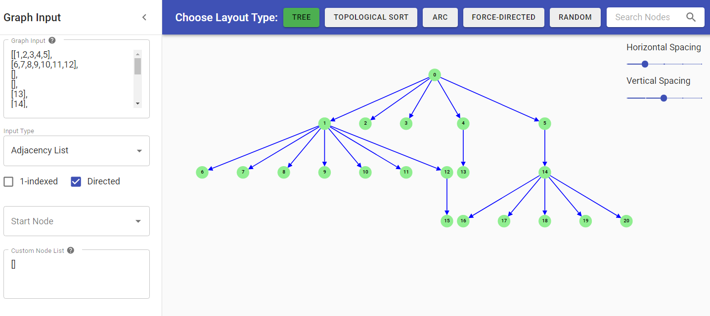

<h1 align="center">
  
  Gee Vis - A Graph Visualization Tool
</h1>

<h4 align="center">
  Convert graphs and trees from their text-based representation into intuitive visual layouts.
</h4>


## :exclamation: About

Gee Vis is a graph visualization tool that receives user input in various commonly used graph and tree formats, and generates well-proportioned and visually intuitive layouts based on different graph layout algorithms. The UI is simple but flexible, providing basic validation on improper input syntax, as well as a handful of configuration options to aid in the user experience.

[Video Demo](https://www.youtube.com/watch?v=v4YOC_g8ABA)

## :mag_right: Features

### User Input
The tool supports most commonly-used graph and tree formats. The syntax for Arrays and Matrices is the same as Javascript Arrays (or Python Lists): comma separated elements enclosed in square brackets. Spacing and newlines outside node names does not matter, and quotes around a node name will automatically be stripped during parsing.

There will be some basic input validation such as making sure brackets are matched, edges in Edge Lists have length 2, JSON syntax is valid, etc. Validation errors will be shown in red under the text field.

#### Supported input formats:
- [Adjacency List](https://en.wikipedia.org/wiki/Adjacency_list) - Example: `[[2, 3], [3], [1], []]`
  - The Adjacency List input type also provides the option to toggle 1-indexed node values. So in the above example, instead of node `0` being connected to `2` and `3`, node `1` would be connected to `2` and `3`
- [Adjacency Matrix](https://en.wikipedia.org/wiki/Adjacency_matrix) - Example: `[[0,0,1], [1,0,1], [1,0,0]]`
- [Edge List](https://en.wikipedia.org/wiki/Edge_list) - Example: `[["A","B"],["B","C"],["B","D"]]`
  - The Edge List input type also provides the option reverse the direction of specified edges. So in the above example, instead of `A` being connected to `B`, `B` would be connected to `A`
- Weighted Edge List - similar to Edge List, but with an additional element in each edge definition to specify the weight of the edge. The resulting graph will be drawn with labels on the edges. Example: `[[0,1,3],[1,2,1],[1,3,4],[2,3,1]]`
- [Binary Heap Array](https://en.wikipedia.org/wiki/Binary_heap#Heap_implementation) - Example: `[1,3,6,5,9,8]`
- [Array serialization of a tree](https://support.leetcode.com/hc/en-us/articles/360011883654-What-does-1-null-2-3-mean-in-binary-tree-representation-) - Example: `[5,1,4,null,null,3,6]`
- JSON Graph Object - `nodes` attribute is an array where each node has an `id`, `value`, and list of `children`. In addition, the JSON object can optionally have a `startNode` attribute, to specify the starting node of the graph (see Start Node below). Example:
```
  {
    "nodes": [
      {"children": ["B", "C", "D"], "id": "A", "value": "A"},
      {"children": ["E", "F"], "id": "B", "value": "B"},
      {"children": [], "id": "C", "value": "C"},
      {"children": ["G", "H"], "id": "D", "value": "D"},
      {"children": [], "id": "E", "value": "E"},
      {"children": ["I", "J"], "id": "F", "value": "F"},
      {"children": ["K"], "id": "G", "value": "G"},
      {"children": [], "id": "H", "value": "H"},
      {"children": [], "id": "I", "value": "I"},
      {"children": [], "id": "J", "value": "J"},
      {"children": [], "id": "K", "value": "K"}
    ],
    "startNode": "A"
  }
```
- JSON Tree Object - similar to JSON Graph, but nodes have `left` and `right` properties instead of `children`. Also, `startNode` is renamed to `root`. Example:
```
{
  "nodes": [
    {"id": "1", "left": "2", "right": null, "value": 1},
    {"id": "2", "left": null, "right": null, "value": 2}
  ],
  "root": "1"
}
 ```
 
#### Start Node
In addition, the user can optionally select a start node out of the list of nodes in the graph - if specified, the layout algorithm will prioritize putting that node at the front of the layout.

#### Custom Node List
The Custom Node List is an optional field which is only used when there is a separate list of nodes to describe the graph along with what was passed into the Graph Input. For example, this could be the case for a graph that describes airport connections - where there is an Edge List to describe airline routes, and a separate list to describe all  available airports. 
 - Example: `["BGI","CDG","DEL","DOH","DSM"]`
 
 
## Layout
Once the Graph Input is entered, the layout will be automatically generated based on the selected layout type. Each layout type will run a best-effort approach regardless of structure of graph that is provided; however, there will obviously be some types of graphs that will work better with certain layout types (i.e. a graph with a ton of cycles might not work well with Tree layout type).

### Supported Layout Types:
- Tree - Will run a modified [Buchheim tree layout algorithm](http://dirk.jivas.de/papers/buchheim02improving.pdf) to produce a tree with the following properties:
  - Edges of the tree should not cross each other
  - All nodes at the same depth should be drawn on the same horizontal line.
  - The tree should be drawn as narrowly as possible.
  - Parents nodes should be centered over their children.
  - A subtree should be drawn the same no matter where in the tree it lies.
  - In addition, for Input Types that describe a binary tree, child branches will always be drawn at an angle to respect the 'left' and 'right' child properties of that child. 
- Topological Sort - Runs a modified topological sort on the graph and tries to break cycles (if they exist). Nodes of the same "level" will be placed in the same horizontal column of the layout. Nodes with backlinks will be placed so that the backlink does not overlap with an existing forward edge. Note: If the graph contains cycles such that no start node can be inferred, the layout will not be run and an error message will be shown instead.
- Arc - A type of layout where nodes are all aligned and the edges are drawn as arcs. This layout type will try to optimize the node ordering to minimize the number of edge crossings in the graph.
- Force-Directed - Uses the D3 library's [force layout](https://www.d3indepth.com/force-layout/) implementation. Nodes and links are treated as objects and a physics based simulation is run to determine the resulting node positions.
- Random - Nodes will be placed randomly on the canvas.

### Note on Disconnected Graphs:
Sometimes a graph can consist of mutliple disconnected components. In such case, the layout algorithm will be run on each connected component and the resulting subgraphs will be layed out next to each other. Lone nodes will be placed in the upper right corner (to reduce clutter).
 

### Layout Canvas Interactions:
The layout canvas is responsive to window resizing and supports the following interactions:
- **Panning:** Click anywhere on the canvas background and drag
- **Zooming:** Zoom in and out using the mouse scroll wheel
- **Adjusting Node Spacing:** Adjust the horizontal and vertical spacing between nodes using the "Horizontal Spacing" and "Vertical Spacing" sliders in the upper right hand corner (only applies to certain layout types)
- **Manually rearranging nodes:** Drag and drop nodes to manually reposition them
- **Node Search:** Search for a specific node using the search bar in the upper right hand corner (press the Enter key in the search bar to execute search). Search is case-insensitive, but requires an exact match on the label of a node. If a match is found, the node will be centered on the canvas and will be highlighted red.
 

## :bulb: Inspiration
In addition to the DFS, BFS, and Topological sort that is used in the layout algorithms, this project attempts to explore some of the deeper research that has been done on trying to figure out how to draw attractive Trees and Graphs that convey useful information. Here are some of concepts, papers, and algorithms that the implementation of the layouts takes inspiration from:

### Tree Layout
- [Buchheim Tree Drawing](http://llimllib.github.io/pymag-trees/): While this project's Tree layout algorithm does not implement the Buchheim Tree algorithm exactly, it does apply a lot of concepts described in this article to draw proportional and consistent trees. In particular, the calculation of contours was crucial in making sure the tree does not get too wide accross.

### Topological Sort
- Ignoring or internally breaking cycles - While the canonical definition of topological sort does not apply to graphs with cycles, the project attempts to follow some of the research that has been done on how to ignore cycles when performing a "best effort" topological traversal.

### Arc Layout
- Minimizing the crossing of edges - the idea of crossing minimization [is NP-hard](https://en.wikipedia.org/wiki/Arc_diagram#Minimizing_crossings), so it was not possible to come up with an optimal solution that would also scale well for large graphs. Instead, this project uses some clever DFS to avoid line crossings for entire subgraphs, and then runs a brute force algorithm on the smaller subgraphs to find the minimum line crossing for that particular subgraph. 

## :computer: Technologies

This project was developed with the following technologies:

- [Typescript](https://www.typescriptlang.org/)
- [ReactJS](https://reactjs.org/)
- [Material-UI](https://material-ui.com/)
- [react-d3-graph](https://github.com/danielcaldas/react-d3-graph)
- [D3](https://d3js.org/)

## :information_source: Installation

To clone and run this application in your machine, you'll need [Git](https://git-scm.com), and [Node.js v12](https://nodejs.org/en/) or higher

```bash
# Clone this repository.
git clone https://github.com/jy-whatthetech/visualization.git
cd visualization

# Install dependencies
npm i

# Run the app, and navigate to http://localhost:3000
npm run start
```
